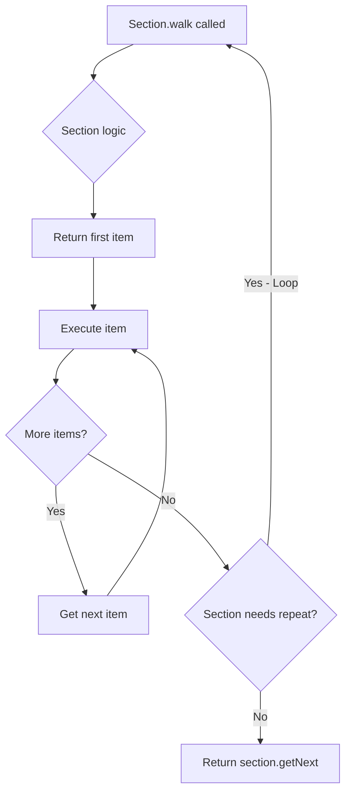

## Overview

The `CodeSection` abstract class represents a section of runnable code that contains multiple statements. It extends `Statement` and provides infrastructure for managing nested code blocks.

**Package:** `io.github.syst3ms.skriptparser.lang`

**Extends:** `Statement`

**Common Implementations:** `SecConditional`, `SecLoop`, `SecWhile`, `ConditionalExpression`

## Class Hierarchy

```text
SyntaxElement
    └── Statement
            └── CodeSection (abstract)
                    ├── SecLoop
                    ├── SecWhile
                    ├── SecConditional
                    ├── SecSwitch
                    └── SecAsync
```

## Fields

### items

```java
protected List<Statement> items
```

The list of all statements contained within this section. This is a flat view of all lines inside the section.

<Warning>
  The items in this list may not all be executed. Use `Statement.runAll()` to run the section's contents.
</Warning>

---

### first

```java
@Nullable
protected Statement first
```

The first statement in this section, or null if the section is empty.

---

### last

```java
@Nullable
protected Statement last
```

The last statement in this section, or null if the section is empty.

## Section Loading

### loadSection()

```java
public boolean loadSection(FileSection section, ParserState parserState, SkriptLogger logger)
```

Loads and parses the contents of this section. This method is called before `init()`.

<ParamField path="section" type="FileSection">
  The file section representing this code section
</ParamField>

<ParamField path="parserState" type="ParserState">
  The current parser state
</ParamField>

<ParamField path="logger" type="SkriptLogger">
  The logger for error reporting
</ParamField>

<ResponseField name="return" type="boolean">
  True if the section was loaded successfully, false if there was a problem
</ResponseField>

<Info>
  The default implementation:
  1. Sets syntax restrictions via `getAllowedSyntaxes()`
  2. Adds this section to the current section stack
  3. Loads all items using `ScriptLoader.loadItems()`
  4. Removes this section from the stack
  5. Clears syntax restrictions
</Info>

<Tip>
  Override this method to perform additional operations on top of the default behavior. Call `super.loadSection()` first.
</Tip>

## Abstract Methods

### walk()

```java
@Override
public abstract Optional<? extends Statement> walk(TriggerContext ctx)
```

Executes this section and returns the next statement to execute. Must be implemented by all code sections.

<ParamField path="ctx" type="TriggerContext">
  The trigger context
</ParamField>

<ResponseField name="return" type="Optional<? extends Statement>">
  The next statement to execute
</ResponseField>

## Overridden Methods

### run()

```java
@Override
@Contract("_ -> fail")
public boolean run(TriggerContext ctx)
```

Not supported for code sections. Always throws `UnsupportedOperationException`.

<Warning>
  Code sections must override `walk()` instead of implementing `run()`.
</Warning>

## Item Management

### getItems()

```java
public List<Statement> getItems()
```

Returns all items inside this section as a flat list.

<ResponseField name="return" type="List<Statement>">
  All statements in this section (not necessarily representative of execution order)
</ResponseField>

<Note>
  The items returned are a flat view of all lines inside the section. They may not all be executed during normal flow.
</Note>

---

### setItems()

```java
public final void setItems(List<Statement> items)
```

Sets the items inside this section and updates parent relationships.

<ParamField path="items" type="List<Statement>">
  The statements to set
</ParamField>

<Info>
  This method automatically:
  - Sets the parent of all items to this section
  - Updates the `first` and `last` fields
</Info>

---

### getFirst()

```java
public final Optional<? extends Statement> getFirst()
```

Returns the first item of this section.

<ResponseField name="return" type="Optional<? extends Statement>">
  The first item, or the item after the section if empty, or empty if there is no item after this section
</ResponseField>

---

### getLast()

```java
protected final Optional<? extends Statement> getLast()
```

Returns the last item of this section.

<ResponseField name="return" type="Optional<? extends Statement>">
  The last item, or the item after the section if empty, or empty if there is no item after this section
</ResponseField>

## Syntax Restrictions

### getAllowedSyntaxes()

```java
protected Set<Class<? extends SyntaxElement>> getAllowedSyntaxes()
```

Returns a list of syntax classes allowed inside this section.

<ResponseField name="return" type="Set<Class<? extends SyntaxElement>>">
  The allowed syntax classes (empty set means no restrictions)
</ResponseField>

<Info>
  Override this method to create specialized, DSL-like sections that only allow specific statements and expressions.
</Info>

---

### isRestrictingExpressions()

```java
protected boolean isRestrictingExpressions()
```

Determines whether syntax restrictions also apply to expressions.

<ResponseField name="return" type="boolean">
  True if expressions are also restricted (default is false)
</ResponseField>

<Warning>
  This should return true **if and only if** `getAllowedSyntaxes()` contains an `Expression` class.
</Warning>

## Validation Methods

### checkFinishing()

```java
public boolean checkFinishing(
    Predicate<? super Statement> finishingTest,
    SkriptLogger logger,
    int currentSectionLine,
    boolean warnUnreachable,
    String errorMessage
)
```

Checks whether all code paths in this section end with a finishing statement.

<ParamField path="finishingTest" type="Predicate<? super Statement>">
  Predicate that tests if a statement is a finishing statement
</ParamField>

<ParamField path="logger" type="SkriptLogger">
  The logger for error reporting
</ParamField>

<ParamField path="currentSectionLine" type="int">
  The line number of this section
</ParamField>

<ParamField path="warnUnreachable" type="boolean">
  Whether to warn about unreachable code
</ParamField>

<ParamField path="errorMessage" type="String">
  The error message to display if validation fails
</ParamField>

<ResponseField name="return" type="boolean">
  True if all paths finish properly
</ResponseField>

---

### checkFinishing() (overload)

```java
public boolean checkFinishing(
    Predicate<? super Statement> finishingTest,
    SkriptLogger logger,
    int currentSectionLine,
    boolean warnUnreachable
)
```

Checks finishing with a default error message.

<ParamField path="finishingTest" type="Predicate<? super Statement>">
  Predicate that tests if a statement is a finishing statement
</ParamField>

<ParamField path="logger" type="SkriptLogger">
  The logger for error reporting
</ParamField>

<ParamField path="currentSectionLine" type="int">
  The line number of this section
</ParamField>

<ParamField path="warnUnreachable" type="boolean">
  Whether to warn about unreachable code
</ParamField>

<ResponseField name="return" type="boolean">
  True if all paths finish properly
</ResponseField>

---

### checkReturns()

```java
public boolean checkReturns(
    SkriptLogger logger,
    int currentSectionLine,
    boolean warnUnreachable
)
```

Checks whether all code paths in this section return a value.

<ParamField path="logger" type="SkriptLogger">
  The logger for error reporting
</ParamField>

<ParamField path="currentSectionLine" type="int">
  The line number of this section
</ParamField>

<ParamField path="warnUnreachable" type="boolean">
  Whether to warn about unreachable code
</ParamField>

<ResponseField name="return" type="boolean">
  True if all paths return a value (via EffReturn)
</ResponseField>

## Implementation Examples

### Basic Loop Section

```java
public class SecLoop extends ArgumentSection implements Continuable, SelfReferencing {
    private Expression<?> expression;
    private Statement actualNext;
    private Iterator<?> iterator;

    @Override
    public boolean loadSection(FileSection section, ParserState parserState, 
                              SkriptLogger logger) {
        if (!super.loadSection(section, parserState, logger))
            return false;
        super.setNext(this); // Loop back to itself
        return true;
    }

    @Override
    public boolean init(Expression<?>[] expressions, int matchedPattern, 
                       ParseContext parseContext) {
        expression = expressions[0];
        if (expression.isSingle()) {
            parseContext.getLogger().error(
                "Cannot loop a single value",
                ErrorType.SEMANTIC_ERROR
            );
            return false;
        }
        return true;
    }

    @Override
    public Optional<? extends Statement> walk(TriggerContext ctx) {
        if (iterator == null) {
            iterator = expression.iterator(ctx);
        }

        if (iterator.hasNext()) {
            setArguments(iterator.next());
            return getFirst(); // Start of loop body
        } else {
            iterator = null; // Clear cache
            return Optional.ofNullable(actualNext); // After loop
        }
    }

    @Override
    public Statement setNext(@Nullable Statement next) {
        this.actualNext = next;
        return this;
    }

    @Override
    public String toString(TriggerContext ctx, boolean debug) {
        return "loop " + expression.toString(ctx, debug);
    }
}
```

### Conditional Section

```java
public class SecConditional extends CodeSection {
    private Expression<Boolean> condition;
    private CodeSection elseSection;

    @Override
    public boolean init(Expression<?>[] expressions, int matchedPattern, 
                       ParseContext parseContext) {
        condition = (Expression<Boolean>) expressions[0];
        return true;
    }

    @Override
    public Optional<? extends Statement> walk(TriggerContext ctx) {
        boolean result = condition.getSingle(ctx).orElse(false);
        
        if (result) {
            // Execute the if-block
            return getFirst();
        } else if (elseSection != null) {
            // Execute the else-block
            return elseSection.getFirst();
        } else {
            // Skip both blocks
            return getNext();
        }
    }

    public void setElseSection(CodeSection elseSection) {
        this.elseSection = elseSection;
    }

    @Override
    public String toString(TriggerContext ctx, boolean debug) {
        return "if " + condition.toString(ctx, debug);
    }
}
```

### Restricted Section

```java
public class SecRestricted extends CodeSection {
    @Override
    protected Set<Class<? extends SyntaxElement>> getAllowedSyntaxes() {
        // Only allow specific effects
        return Set.of(
            EffPrint.class,
            EffReturn.class
        );
    }

    @Override
    protected boolean isRestrictingExpressions() {
        return false; // Allow all expressions
    }

    @Override
    public Optional<? extends Statement> walk(TriggerContext ctx) {
        // Execute all items sequentially
        Statement.runAll(first, ctx);
        return getNext();
    }
}
```

## Execution Flow



## Built-in Sections

The Skript Parser includes several built-in code sections:

- **SecLoop** - Iterates over expression values
- **SecWhile** - Loops while a condition is true
- **SecConditional** - If/else conditional execution
- **SecSwitch** - Multi-way branching
- **SecAsync** - Asynchronous execution
- **SecMap** - Transforms values in a list
- **SecFilter** - Filters values in a list

## Best Practices

<Tip>
  **Call super.loadSection()**: When overriding `loadSection()`, always call `super.loadSection()` first to ensure proper initialization.
</Tip>

<Tip>
  **Use getFirst() to start execution**: In `walk()`, return `getFirst()` to begin executing the section's contents.
</Tip>

<Warning>
  **Don't implement run()**: Code sections should override `walk()`, not `run()`. The `run()` method throws `UnsupportedOperationException`.
</Warning>

<Warning>
  **Manage iteration state**: If your section needs to iterate (like loops), store iterator state in fields and clear it when done.
</Warning>

<Tip>
  **Validate at load time**: Use `loadSection()` to perform validation that requires access to the section structure.
</Tip>

## See Also

- [Statement](/api/statements) - Base class for all runnable code
- [Effect](/api/effects) - For simple sequential statements
- [Expression](/api/expressions) - For value-returning syntax elements
