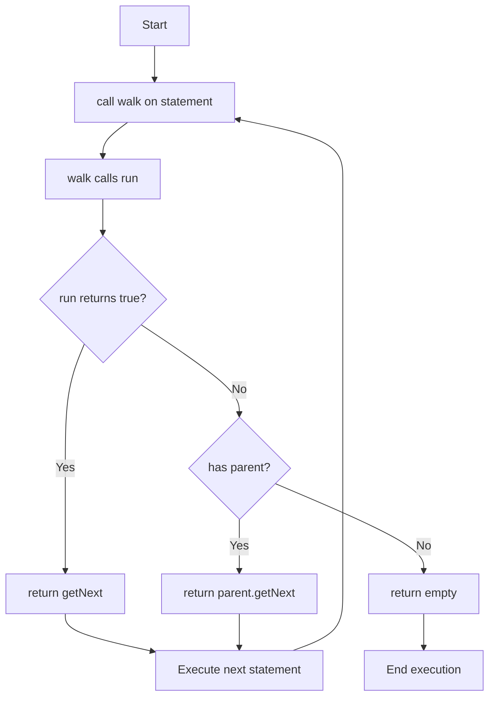

## Overview

The `Statement` abstract class is the base class for any runnable line of code inside of a script. It provides the fundamental execution model for all code in Skript Parser.

**Package:** `io.github.syst3ms.skriptparser.lang`

**Implements:** `SyntaxElement`

**Direct Subclasses:** `Effect`, `CodeSection`

## Class Hierarchy

```
SyntaxElement
    └── Statement (abstract)
            ├── Effect (abstract)
            └── CodeSection (abstract)
```

## Fields

### parent

```java
@Nullable
protected CodeSection parent
```

The parent code section containing this statement, or null if this is a top-level statement.

---

### next

```java
@Nullable
protected Statement next
```

The statement that follows this one in the file, or null if this is the last statement in its section.

---

### illegalStateRunnable

```java
public static Consumer<IllegalStateException> illegalStateRunnable
```

Global handler for `IllegalStateException` thrown during script execution.

---

### exceptionHandler

```java
public static Consumer<Exception> exceptionHandler
```

Global handler for general exceptions thrown during script execution.

## Static Methods

### setIllegalStateHandler()

```java
public static void setIllegalStateHandler(Consumer<IllegalStateException> consumer)
```

Sets the global handler for illegal state exceptions.

<ParamField path="consumer" type="Consumer<IllegalStateException>">
  The exception handler
</ParamField>

---

### setExceptionHandler()

```java
public static void setExceptionHandler(Consumer<Exception> consumer)
```

Sets the global handler for general exceptions.

<ParamField path="consumer" type="Consumer<Exception>">
  The exception handler
</ParamField>

---

### runAll()

```java
public static boolean runAll(Statement start, TriggerContext context)
```

Runs all code starting at a given statement sequentially. Does not clear local variables after running.

<ParamField path="start" type="Statement">
  The statement to start execution from
</ParamField>

<ParamField path="context" type="TriggerContext">
  The trigger context
</ParamField>

<ResponseField name="return" type="boolean">
  True if the code ran normally, false if any exception occurred
</ResponseField>

<Note>
  This method handles `StackOverflowError` (infinite loops), `IllegalStateException`, and general exceptions using the configured handlers.
</Note>

## Abstract Methods

### run()

```java
public abstract boolean run(TriggerContext ctx)
```

Executes this statement.

<ParamField path="ctx" type="TriggerContext">
  The trigger context
</ParamField>

<ResponseField name="return" type="boolean">
  True if execution should continue to the next statement, false if execution should stop or jump elsewhere
</ResponseField>

## Instance Methods

### getParent()

```java
public Optional<? extends CodeSection> getParent()
```

Returns the parent section of this statement.

<ResponseField name="return" type="Optional<? extends CodeSection>">
  The parent code section, or empty if this is a top-level statement
</ResponseField>

---

### setParent()

```java
public Statement setParent(CodeSection section)
```

Sets the parent code section of this statement.

<ParamField path="section" type="CodeSection">
  The parent section
</ParamField>

<ResponseField name="return" type="Statement">
  This statement (for method chaining)
</ResponseField>

---

### getNext()

```java
public final Optional<? extends Statement> getNext()
```

Returns the statement after this one in the file.

<ResponseField name="return" type="Optional<? extends Statement>">
  The next statement, or if this is the last item in a section, the statement after the section, or empty if this is the very last statement
</ResponseField>

<Note>
  This method is final and handles the logic of traversing up to parent sections when necessary.
</Note>

---

### setNext()

```java
public Statement setNext(@Nullable Statement next)
```

Sets the statement that is placed after this statement in the file.

<ParamField path="next" type="Statement">
  The statement following this one (can be null)
</ParamField>

<ResponseField name="return" type="Statement">
  This statement (for method chaining)
</ResponseField>

<Info>
  You can assume that the `next` statement of the `next` parameter is already known if it has such a statement.
</Info>

---

### walk()

```java
public Optional<? extends Statement> walk(TriggerContext ctx)
```

Executes this statement and determines the next statement to execute.

<ParamField path="ctx" type="TriggerContext">
  The trigger context
</ParamField>

<ResponseField name="return" type="Optional<? extends Statement>">
  The next statement to be executed, or empty if this is the last statement
</ResponseField>

<Info>
  By default, this method calls `run()` and returns `getNext()` if it returns true, or the statement after the parent section otherwise. This method can be overridden for custom control flow.
</Info>

## Inherited from SyntaxElement

### init()

```java
boolean init(Expression<?>[] expressions, int matchedPattern, ParseContext parseContext)
```

Initializes this statement before being used.

<ParamField path="expressions" type="Expression<?>[]">
  An array of expressions passed to this syntax element (never contains null)
</ParamField>

<ParamField path="matchedPattern" type="int">
  The index of the pattern that was successfully matched
</ParamField>

<ParamField path="parseContext" type="ParseContext">
  Additional parsing information (regex matches, parse marks)
</ParamField>

<ResponseField name="return" type="boolean">
  True if initialization was successful, false otherwise
</ResponseField>

---

### toString()

```java
String toString(TriggerContext ctx, boolean debug)
```

Returns a string representation of this statement.

<ParamField path="ctx" type="TriggerContext">
  The trigger context
</ParamField>

<ParamField path="debug" type="boolean">
  Whether to show additional debug information
</ParamField>

<ResponseField name="return" type="String">
  A string that should resemble what is written in the script
</ResponseField>

## Execution Flow

The execution flow of statements follows this pattern:



## Usage Examples

### Basic Effect Implementation

```java
public class EffExample extends Effect {
    @Override
    protected void execute(TriggerContext ctx) {
        // Effect logic here
    }
    
    // run() is already implemented by Effect to call execute()
    // and return true
}
```

### Custom Control Flow

```java
public class StmtConditional extends Statement {
    private Expression<Boolean> condition;
    private Statement ifTrue;
    private Statement ifFalse;
    
    @Override
    public boolean run(TriggerContext ctx) {
        // Not used when walk() is overridden
        throw new UnsupportedOperationException();
    }
    
    @Override
    public Optional<? extends Statement> walk(TriggerContext ctx) {
        boolean result = condition.getSingle(ctx).orElse(false);
        if (result && ifTrue != null) {
            return Optional.of(ifTrue);
        } else if (!result && ifFalse != null) {
            return Optional.of(ifFalse);
        } else {
            return getNext();
        }
    }
}
```

### Sequential Execution

```java
// Execute a chain of statements
Statement first = /* ... */;
Statement second = /* ... */;
Statement third = /* ... */;

first.setNext(second);
second.setNext(third);

TriggerContext ctx = new TriggerContext(/* ... */);
boolean success = Statement.runAll(first, ctx);

if (success) {
    System.out.println("All statements executed successfully");
} else {
    System.out.println("Execution failed");
}
```

### Exception Handling

```java
// Set custom exception handlers
Statement.setIllegalStateHandler(e -> {
    System.err.println("Illegal state: " + e.getMessage());
    e.printStackTrace();
});

Statement.setExceptionHandler(e -> {
    System.err.println("Exception during execution: " + e.getMessage());
    // Log to file, send alert, etc.
});
```

## Relationship to Other Classes

### Statement vs Effect

- **Statement** is the abstract base class
- **Effect** extends Statement and provides a simplified execution model
- Effects always continue execution (return true from run())
- Custom statements can override `walk()` for complex control flow

### Statement vs CodeSection

- **CodeSection** extends Statement and contains multiple statements
- Sections override `walk()` to manage their internal execution
- Sections cannot use `run()` (throws `UnsupportedOperationException`)

## Best Practices

<Tip>
  **Use Effect for simple statements**: If your statement just executes and continues, extend `Effect` instead of `Statement`.
</Tip>

<Tip>
  **Override walk() for control flow**: If you need to change execution flow, override `walk()` instead of `run()`.
</Tip>

<Warning>
  **Don't break the chain**: Always ensure `setNext()` and `setParent()` are called correctly to maintain the execution chain.
</Warning>

<Warning>
  **Handle infinite loops**: Be careful with recursive `walk()` implementations to avoid `StackOverflowError`.
</Warning>

## See Also

- [Effect](/api/effects) - Simplified statement for sequential execution
- [CodeSection](/api/code-sections) - For sections containing multiple statements
- [Expression](/api/expressions) - For value-returning syntax elements
