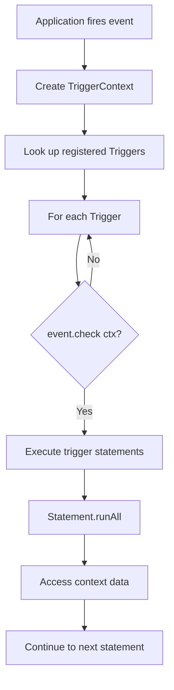

## Overview

The event system is the entry point for all code execution in Skript. Once an event triggers, all of the code inside it may be run. The system is composed of three interacting components: `Trigger`, `SkriptEvent`, and `TriggerContext`.

<Info>
This is directly parallel to Skript's event system, with Bukkit's own Event class being replaced by TriggerContext in this standalone implementation.
</Info>

## The Kitchen Analogy

Location: `io.github.syst3ms.skriptparser.lang.event.SkriptEvent`

Let's explain how this system works using a simple analogy: skript-parser is like a giant kitchen:

- The goal is to **prepare food** (write code)
- There are many different **types of food to prepare** (`TriggerContext`s)
- There are different **means of actually preparing the food** (different `SkriptEvent`s), each one being specific to one or more types of food
- Finally, in order to make the recipe come together, one needs the **physical, tangible tools** to achieve that (`Trigger`s)

## TriggerContext

Location: `io.github.syst3ms.skriptparser.lang.TriggerContext`

**A context under which a trigger may be run.**

```java
public interface TriggerContext {
    /**
     * A dummy TriggerContext that may be used when 
     * the context is known not to matter.
     */
    TriggerContext DUMMY = () -> "dummy";

    String getName();
}
```

<Note>
The `TriggerContext` is intentionally minimal. Implementations can extend this interface to provide event-specific data (e.g., player information in a Minecraft context, file data in a CLI context, etc.).
</Note>

### Purpose

The TriggerContext:

- Represents the **runtime environment** in which code executes
- Provides **event-specific data** to expressions and effects
- Allows the parser to be **platform-agnostic** (not tied to Minecraft)

### Example Usage

Different applications can define their own contexts:

```java
// Minecraft context
public class PlayerClickContext implements TriggerContext {
    private final Player player;
    private final Block clickedBlock;
    
    @Override
    public String getName() {
        return "player click";
    }
    
    public Player getPlayer() { return player; }
    public Block getClickedBlock() { return clickedBlock; }
}

// CLI context
public class ConsoleInputContext implements TriggerContext {
    private final String input;
    
    @Override
    public String getName() {
        return "console input";
    }
    
    public String getInput() { return input; }
}
```

## SkriptEvent

Location: `io.github.syst3ms.skriptparser.lang.event.SkriptEvent`

**The entry point for all code in Skript. Defines when and how code should be triggered.**

```java
public abstract class SkriptEvent implements SyntaxElement {

    /**
     * Whether this event should trigger, 
     * given the TriggerContext
     */
    public abstract boolean check(TriggerContext ctx);

    /**
     * Load the section contents
     */
    public List<Statement> loadSection(FileSection section, 
                                      ParserState parserState, 
                                      SkriptLogger logger) {
        return ScriptLoader.loadItems(section, parserState, logger);
    }

    @Override
    public boolean init(Expression<?>[] expressions, 
                       int matchedPattern, 
                       ParseContext parseContext) {
        return false;
    }
}
```

### The check() Method

The `check()` method determines whether this event should trigger for a given context:

```java
public abstract boolean check(TriggerContext ctx);
```

Example implementation:

```java
public class EvtPlayerClick extends SkriptEvent {
    private ItemType heldItem;
    
    @Override
    public boolean check(TriggerContext ctx) {
        if (!(ctx instanceof PlayerClickContext)) {
            return false;
        }
        
        PlayerClickContext clickCtx = (PlayerClickContext) ctx;
        
        // Check if player is holding the specified item
        if (heldItem != null) {
            return clickCtx.getPlayer()
                .getInventory()
                .getItemInMainHand()
                .getType() == heldItem;
        }
        
        return true;
    }
}
```

<Warning>
The `check()` method is called for EVERY registered trigger when an event occurs. Expensive operations here can impact performance.
</Warning>

### Loading Priority

```java
/**
 * Triggers with a higher loading priority number 
 * will be loaded first.
 * 
 * @return the loading priority number. 500 by default
 */
public int getLoadingPriority() {
    return 500;
}
```

<Accordion title="Why Loading Priority Matters">
  For virtually all programming and scripting languages, the need exists to have functions in order to not repeat code too often. Skript is no exception. However, by default, every trigger is loaded in the order it appears in the file.
  
  This is undesirable if we don't want the restriction of having to declare functions before using them. This is especially counter-productive if we're dealing with multiple scripts.
  
  To solve this problem, triggers with a higher loading priority number will be loaded first.
  
  **Common priorities:**
  - Functions: Higher priority (e.g., 1000)
  - Commands: Medium-high priority (e.g., 750)
  - Regular events: Default priority (500)
  - Delayed initialization: Lower priority (e.g., 250)
</Accordion>

### Syntax Restrictions

Events can restrict what syntax is allowed inside them:

```java
/**
 * A list of the classes of every syntax that is 
 * allowed to be used inside of this SkriptEvent.
 */
public Set<Class<? extends SyntaxElement>> getAllowedSyntaxes() {
    return Collections.emptySet();
}

/**
 * Whether the syntax restrictions should also 
 * apply to expressions.
 */
public boolean isRestrictingExpressions() {
    return false;
}
```

<Info>
Returning an empty set from `getAllowedSyntaxes()` means no restrictions. Returning `null` would disallow ALL syntax.
</Info>

This allows the creation of specialized, DSL-like sections:

```java
public class EvtFunctionDefinition extends SkriptEvent {
    @Override
    public Set<Class<? extends SyntaxElement>> getAllowedSyntaxes() {
        // Only allow return statements and specific expressions
        return Set.of(
            EffReturn.class,
            SecConditional.class,
            SecLoop.class
        );
    }
}
```

### Unloading

```java
/**
 * Called when this event is unloaded.
 * This is optional to override.
 */
public void unload() {
    // Cleanup resources, unregister listeners, etc.
}
```

## Trigger

Location: `io.github.syst3ms.skriptparser.lang.Trigger`

**A top-level section that is not contained in code. Usually declares an event.**

```java
public class Trigger extends CodeSection {
    private final SkriptEvent event;

    public Trigger(SkriptEvent event) {
        this.event = event;
    }

    @Override
    public boolean init(Expression<?>[] expressions, 
                       int matchedPattern, 
                       ParseContext parseContext) {
        return true;
    }

    @Override
    public Optional<? extends Statement> walk(TriggerContext ctx) {
        return getFirst().filter(__ -> event.check(ctx));
    }

    public SkriptEvent getEvent() {
        return event;
    }
}
```

### Loading Process

When a trigger loads its section, it:

1. Sets syntax restrictions from the event
2. Adds itself to the current section stack
3. Loads all items inside
4. Removes itself from the section stack
5. Clears syntax restrictions

```java
@Override
public boolean loadSection(FileSection section, 
                          ParserState parserState, 
                          SkriptLogger logger) {
    parserState.setSyntaxRestrictions(
        event.getAllowedSyntaxes(), 
        event.isRestrictingExpressions()
    );
    parserState.addCurrentSection(this);
    setItems(event.loadSection(section, parserState, logger));
    parserState.removeCurrentSection();
    parserState.clearSyntaxRestrictions();
    return true;
}
```

### Execution

The `walk()` method determines whether the trigger should execute:

```java
@Override
public Optional<? extends Statement> walk(TriggerContext ctx) {
    return getFirst().filter(__ -> event.check(ctx));
}
```

<Note>
The trigger only executes if `event.check(ctx)` returns `true`. This allows events to filter which contexts they respond to.
</Note>

## Data Flow

Here's how events flow through the system:



## TriggerMap Registration

Location: Referenced in `ScriptLoader.java:103-108`

Triggers are registered with the `TriggerMap` for execution:

```java
Set<Class<? extends TriggerContext>> contexts = 
    unloaded.eventInfo().getContexts();
    
if (contexts.isEmpty()) {
    // A dummy context will be used for this
    TriggerMap.addTrigger(scriptName, TriggerContext.class, loaded);
} else {
    for (Class<? extends TriggerContext> context : contexts) {
        TriggerMap.addTrigger(scriptName, context, loaded);
    }
}
```

<Info>
Triggers can be registered for multiple context types, allowing the same code to respond to different events.
</Info>

## Example: Custom Event

Here's a complete example of implementing a custom event:

```java
/**
 * @name File Read Event
 * @pattern on file read[ing]
 * @since 1.0.0
 */
public class EvtFileRead extends SkriptEvent {
    
    static {
        MainRegistration.register(
            EvtFileRead.class,
            "on file read[ing]"
        );
    }
    
    @Override
    public boolean init(Expression<?>[] expressions,
                       int matchedPattern,
                       ParseContext parseContext) {
        // No expressions to capture
        return true;
    }
    
    @Override
    public boolean check(TriggerContext ctx) {
        // Only trigger for FileReadContext
        return ctx instanceof FileReadContext;
    }
    
    @Override
    public int getLoadingPriority() {
        // Load after functions (1000) but before default (500)
        return 750;
    }
    
    @Override
    public String toString(TriggerContext ctx, boolean debug) {
        return "on file read";
    }
}
```

## Script Structure

A typical script has this structure:

```vba
on [event pattern]:
    # This is the trigger section
    # All code here runs when the event fires
    effect statement
    if condition:
        nested effect
    loop expression:
        loop effect
```

<Warning>
All code must be inside a trigger. Code outside of triggers will cause a parse error.
</Warning>

## Multiple Triggers

A script can contain multiple triggers:

```vba
on event one:
    # Code for event one
    print "Event one fired"

on event two:
    # Code for event two  
    print "Event two fired"
```

Each trigger is independent and will execute when its specific event fires.
