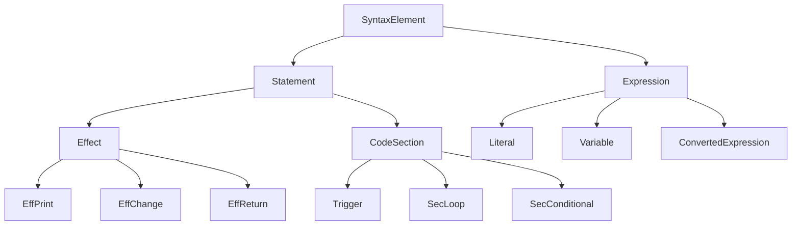

## Overview

Expressions and Effects are the two fundamental types of executable syntax elements in Skript. Understanding the difference between them is crucial for working with the parser.

## Effects

Location: `io.github.syst3ms.skriptparser.lang.Effect`

**An Effect is a line of code that is executed before moving on to the next one.**

Effects perform actions but do not return values. They extend the `Statement` class and implement a simple execution model.

### Effect Class Definition

```java
public abstract class Effect extends Statement {

    protected abstract void execute(TriggerContext ctx);

    @Override
    public boolean run(TriggerContext ctx) {
        execute(ctx);
        return true;
    }
}
```

<Info>
Effects always return `true` from their `run()` method, indicating that execution should continue to the next statement.
</Info>

### Example: Print Effect

Location: `io.github.syst3ms.skriptparser.effects.EffPrint`

```java
/**
 * Prints some text to the console
 *
 * @name Print
 * @pattern print %strings% [to [the] console]
 * @since ALPHA
 * @author Syst3ms
 */
public class EffPrint extends Effect {
    private Expression<String> expression;

    @Override
    public boolean init(Expression<?>[] expressions, 
                       int matchedPattern, 
                       ParseContext parseContext) {
        expression = (Expression<String>) expressions[0];
        return true;
    }

    @Override
    public void execute(TriggerContext ctx) {
        for (String val : TaggedExpression.apply(expression, ctx, "console")) {
            System.out.println(val);
        }
    }

    @Override
    public String toString(TriggerContext ctx, boolean debug) {
        return "print " + expression.toString(ctx, debug);
    }
}
```

### Common Effect Types

The parser includes several built-in effects:

- **EffPrint**: Output text to console
- **EffChange**: Modify expression values (set, add, remove, etc.)
- **EffReturn**: Return a value from a function
- **EffExit**: Exit the current trigger
- **EffContinue**: Continue to the next loop iteration
- **EffAsync**: Execute code asynchronously

## Expressions

Location: `io.github.syst3ms.skriptparser.lang.Expression`

**An Expression is a SyntaxElement representing a value with some type.**

Unlike Effects, Expressions return values and can be used as parameters in other syntax elements.

### Expression Interface

```java
public interface Expression<T> extends SyntaxElement {
    /**
     * Retrieves all values of this Expression, 
     * accounting for possible modifiers.
     */
    T[] getValues(TriggerContext ctx);

    /**
     * Gets a single value out of this Expression
     */
    default Optional<? extends T> getSingle(TriggerContext ctx) {
        var values = getValues(ctx);
        if (values == null || values.length == 0) {
            return Optional.empty();
        } else if (values.length > 1) {
            throw new SkriptRuntimeException(
                "Can't call getSingle on an expression " +
                "that returns multiple values!"
            );
        } else {
            return Optional.ofNullable(values[0]);
        }
    }

    /**
     * @return the return type of this expression
     */
    default Class<? extends T> getReturnType() { ... }

    /**
     * @return whether this expression returns a single value
     */
    default boolean isSingle() { ... }
}
```

<Note>
Expressions can return either a single value or multiple values (arrays). The `isSingle()` method indicates which is expected.
</Note>

### Expression Values

Expressions provide two main methods for retrieving values:

<Accordion title="getValues() vs getArray()">
  **getValues(TriggerContext ctx)**
  
  Retrieves values accounting for modifiers. For example, if the expression is an or-list, it will choose a random value to return.
  
  **getArray(TriggerContext ctx)**
  
  Retrieves all values without accounting for modifiers. Even if it's an or-list, it returns all possible values.
</Accordion>

### Example: Arithmetic Operators

Location: `io.github.syst3ms.skriptparser.expressions.ExprArithmeticOperators`

```java
/**
 * Various arithmetic expressions, including addition, 
 * subtraction, multiplication, division and exponentiation.
 *
 * @name Arithmetic Operators
 * @pattern %number%[ ]+[ ]%number%
 * @pattern %number%[ ]-[ ]%number%
 * @pattern %number%[ ]*[ ]%number%
 * @pattern %number%[ ]/[ ]%number%
 * @pattern %number%[ ]^[ ]%number%
 * @since ALPHA
 */
public class ExprArithmeticOperators implements Expression<Number> {
    private Expression<? extends Number> first, second;
    private Operator op;

    @Override
    public boolean init(Expression<?>[] exprs, 
                       int matchedPattern, 
                       ParseContext parseContext) {
        first = (Expression<? extends Number>) exprs[0];
        second = (Expression<? extends Number>) exprs[1];
        op = PATTERNS.getInfo(matchedPattern);
        
        // Validation: check for division by zero
        if (op == Operator.DIV && second instanceof Literal) {
            Optional<? extends Number> value = 
                ((Literal<? extends Number>) second).getSingle();
            if (value.filter(n -> n.doubleValue() == 0).isPresent()) {
                parseContext.getLogger().error(
                    "Cannot divide by 0!",
                    ErrorType.SEMANTIC_ERROR
                );
                return false;
            }
        }
        return true;
    }

    @Override
    public Number[] getValues(TriggerContext ctx) {
        return DoubleOptional.ofOptional(
            first.getSingle(ctx), 
            second.getSingle(ctx)
        )
        .map(f -> (Number) f, s -> (Number) s)
        .mapToOptional((f, s) -> new Number[]{op.calculate(f, s)})
        .orElse(new Number[0]);
    }
}
```

## Key Differences

| Aspect | Effects | Expressions |
|--------|---------|-------------|
| **Returns value** | No | Yes |
| **Used as parameter** | No | Yes |
| **Extends** | `Statement` | `SyntaxElement` |
| **Main method** | `execute()` | `getValues()` |
| **Can be nested** | No | Yes |

<Warning>
Effects cannot be used inside other syntax elements, while Expressions can be nested within Effects, other Expressions, and Sections.
</Warning>

## Change Modes

Expressions can optionally support change modes, allowing them to be modified:

```java
/**
 * Determines whether this expression can be changed 
 * according to a specific ChangeMode
 */
default Optional<Class<?>[]> acceptsChange(ChangeMode mode) {
    return Optional.empty();
}

/**
 * Changes this expression with the given values 
 * according to the given mode
 */
default void change(TriggerContext ctx, 
                   ChangeMode changeMode, 
                   Object[] changeWith) { 
    /* Nothing */ 
}
```

### Available Change Modes

- **SET**: Replace the current value
- **ADD**: Add to the current value
- **REMOVE**: Remove from the current value
- **DELETE**: Delete the value entirely
- **RESET**: Reset to default value

## Type Conversion

Expressions support automatic type conversion:

```java
/**
 * Converts this expression from its current type (T) 
 * to another type, using converters.
 */
default <C> Optional<? extends Expression<C>> convertExpression(
    Class<C> to
) {
    return ConvertedExpression.newInstance(this, to);
}
```

<Info>
The parser automatically attempts to convert expressions when types don't match, using registered converters.
</Info>

## Checking and Filtering

Expressions provide utility methods for filtering values:

```java
/**
 * Checks an array of elements against a given predicate
 */
static <T> boolean check(T[] all, 
                        Predicate<? super T> predicate, 
                        boolean negated, 
                        boolean and) {
    boolean hasElement = false;
    for (var t : all) {
        if (t == null)
            continue;
        hasElement = true;
        boolean b = predicate.test(t);
        if (and && !b)
            return negated;
        if (!and && b)
            return !negated;
    }
    if (!hasElement)
        return negated;
    return negated != and;
}
```

## Class Hierarchy



<Note>
All syntax elements implement the `SyntaxElement` interface, which requires an `init()` method and a `toString()` method.
</Note>

## Iteration and Streaming

Expressions support both iteration and streaming:

```java
/**
 * @return an iterator of the values of this expression
 */
default Iterator<? extends T> iterator(TriggerContext ctx) {
    return Arrays.asList(getValues(ctx)).iterator();
}

/**
 * @return a stream of the values of this expression
 */
default Stream<? extends T> stream(TriggerContext ctx) {
    T[] values = getValues(ctx);
    if (values != null && values.length > 0) {
        return Arrays.stream(values);
    }
    return Stream.empty();
}
```

This allows expressions to be used with Java's functional programming features:

```java
expression.stream(ctx)
    .filter(x -> x > 0)
    .map(x -> x * 2)
    .forEach(System.out::println);
```
