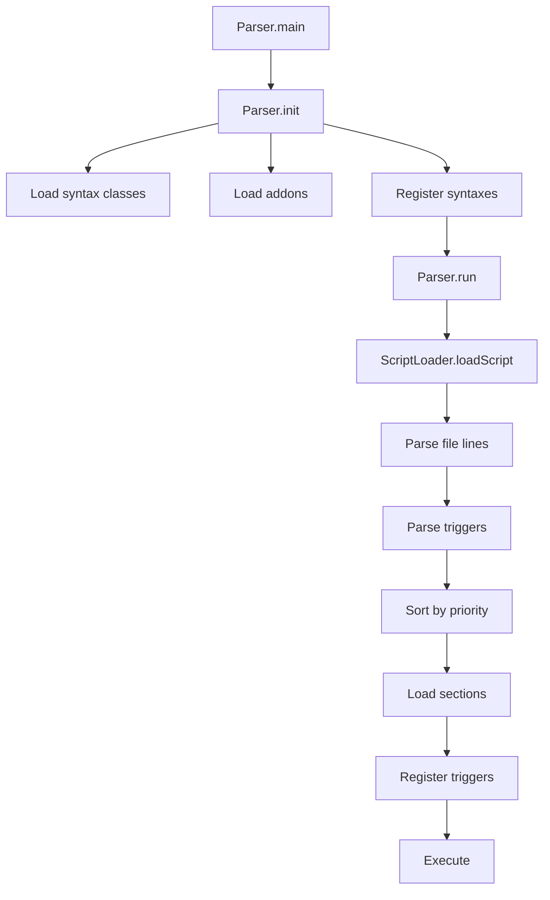

## Overview

The parsing process in skript-parser transforms text-based script files into executable code structures. This involves multiple stages: file loading, syntax parsing, pattern matching, and error handling.

## Main Components

The parsing system consists of two primary classes:

### Parser Class

Location: `io.github.syst3ms.skriptparser.Parser`

The `Parser` class serves as the main entry point for the application. It handles:

- **Initialization**: Setting up the registration system
- **Addon loading**: Discovering and loading external addons
- **Script execution**: Running parsed scripts
- **Logging**: Displaying parse-time and runtime logs

```java
public static void init(String[] mainPackages, 
                       String[] subPackages, 
                       String[] programArgs, 
                       boolean standalone)
```

<Note>
The `init` method loads all syntax classes from specified packages and optionally loads addons from an "addons" directory when running in standalone mode.
</Note>

### ScriptLoader Class

Location: `io.github.syst3ms.skriptparser.parsing.ScriptLoader`

**Contains the logic for loading, parsing, and interpreting entire script files.**

```java
public static List<LogEntry> loadScript(Path scriptPath, 
                                       boolean debug)
```

## The Loading Process

The script loading process follows these steps:

### 1. File Parsing

The script file is read line by line and converted into `FileElement` structures:

```java
var lines = FileUtils.readAllLines(scriptPath);

elements = FileParser.parseFileLines(scriptName,
    lines,
    0,
    1,
    logger
);
```

<Info>
The `FileParser` breaks down the script into hierarchical elements, preserving indentation and structure.
</Info>

### 2. Trigger Parsing

Each top-level section in the script is parsed as a trigger (event handler):

```java
if (element instanceof FileSection) {
    var trig = SyntaxParser.parseTrigger((FileSection) element, logger);
    trig.ifPresent(t -> {
        logger.setLine(logger.getLine() + ((FileSection) element).length());
        unloadedTriggers.add(t);
    });
}
```

<Warning>
Code outside of a trigger will generate an error: "Can't have code outside of a trigger". All code must start with an event declaration.
</Warning>

### 3. Priority Sorting

Triggers are sorted by their event's loading priority before being loaded:

```java
unloadedTriggers.sort((a, b) -> 
    b.trigger().getEvent().getLoadingPriority() - 
    a.trigger().getEvent().getLoadingPriority()
);
```

<Accordion title="Why Loading Priority Matters">
  Loading priority allows certain triggers to be loaded before others. This is particularly important for:
  
  - **Functions**: Must be declared before being used
  - **Variable initialization**: Setting up global state
  - **Configuration loading**: Preparing settings for other scripts
  
  Events with higher priority numbers are loaded first. The default priority is 500.
</Accordion>

### 4. Section Loading

Each trigger loads its internal sections and statements:

```java
loaded.loadSection(unloaded.section(), 
                  unloaded.parserState(), 
                  logger);
```

### 5. Trigger Registration

Finally, triggers are registered with the `TriggerMap` for execution:

```java
Set<Class<? extends TriggerContext>> contexts = 
    unloaded.eventInfo().getContexts();
    
if (contexts.isEmpty()) {
    TriggerMap.addTrigger(scriptName, TriggerContext.class, loaded);
} else {
    for (Class<? extends TriggerContext> context : contexts) {
        TriggerMap.addTrigger(scriptName, context, loaded);
    }
}
```

## Loading Section Items

The `loadItems` method processes statements within a section:

```java
public static List<Statement> loadItems(FileSection section, 
                                       ParserState parserState, 
                                       SkriptLogger logger)
```

This method:

1. **Recurses** into nested sections
2. **Parses** each line as either a section or an effect
3. **Links** statements together using the `setNext()` method
4. **Tracks** the current statement stack for context-aware parsing

```java
for (var element : elements) {
    logger.finalizeLogs();
    logger.nextLine();
    
    if (element instanceof VoidElement)
        continue;
        
    if (element instanceof FileSection) {
        var codeSection = SyntaxParser.parseSection(
            (FileSection) element, 
            parserState, 
            logger
        );
        if (codeSection.isPresent()) {
            parserState.addCurrentStatement(codeSection.get());
            items.add(codeSection.get());
        }
    } else {
        var statement = SyntaxParser.parseEffect(
            element.getLineContent(), 
            parserState, 
            logger
        );
        if (statement.isPresent()) {
            parserState.addCurrentStatement(statement.get());
            items.add(statement.get());
        }
    }
}
```

## Pattern Matching System

The parser uses a sophisticated pattern matching system to identify and parse syntax elements. Patterns are registered with specific syntax classes and matched against input strings.

### Key Pattern Features

- **Text matching**: Case and whitespace insensitive
- **Expression placeholders**: `%type%` syntax for capturing values
- **Optional groups**: `[optional text]` syntax
- **Choice groups**: `(option1|option2)` syntax
- **Regex support**: `<regex>` for complex patterns

See the [Patterns](/concepts/patterns) page for detailed information.

## Error Handling and Logging

The `SkriptLogger` class tracks errors, warnings, and debug information throughout the parsing process:

```java
logger.error(
    "Can't have code outside of a trigger",
    ErrorType.STRUCTURE_ERROR,
    "Code always starts with a trigger (or event). " +
    "Refer to the documentation to see which event you need"
);
```

### Log Types

<Accordion title="Available Log Types">
  **ERROR**: Critical issues that prevent parsing or execution
  
  **WARNING**: Non-critical issues that might indicate problems
  
  **INFO**: Informational messages about the parsing process
  
  **DEBUG**: Detailed debugging information (only shown with --debug flag)
</Accordion>

### Log Output

Logs are collected during parsing and displayed with timestamps and color coding:

```java
public static void printLogs(List<LogEntry> logs, 
                            Calendar time, 
                            boolean tipsEnabled) {
    for (LogEntry log : logs) {
        ConsoleColors color = ConsoleColors.WHITE;
        if (log.getType() == LogType.WARNING) {
            color = ConsoleColors.YELLOW;
        } else if (log.getType() == LogType.ERROR) {
            color = ConsoleColors.RED;
        }
        System.out.printf(color + CONSOLE_FORMAT + ConsoleColors.RESET, 
                         time, log.getType().name(), log.getMessage());
        
        if (tipsEnabled && log.getTip().isPresent())
            System.out.printf(ConsoleColors.BLUE_BRIGHT + 
                            CONSOLE_FORMAT + ConsoleColors.RESET, 
                            time, "TIP", log.getTip().get());
    }
}
```

<Note>
The parser supports optional **tips** alongside error messages to help users understand and fix issues.
</Note>

## Initialization Flow

Here's the complete initialization and execution flow:



<Info>
The parser is designed to fail gracefully, collecting all errors before displaying them, rather than stopping at the first error.
</Info>
